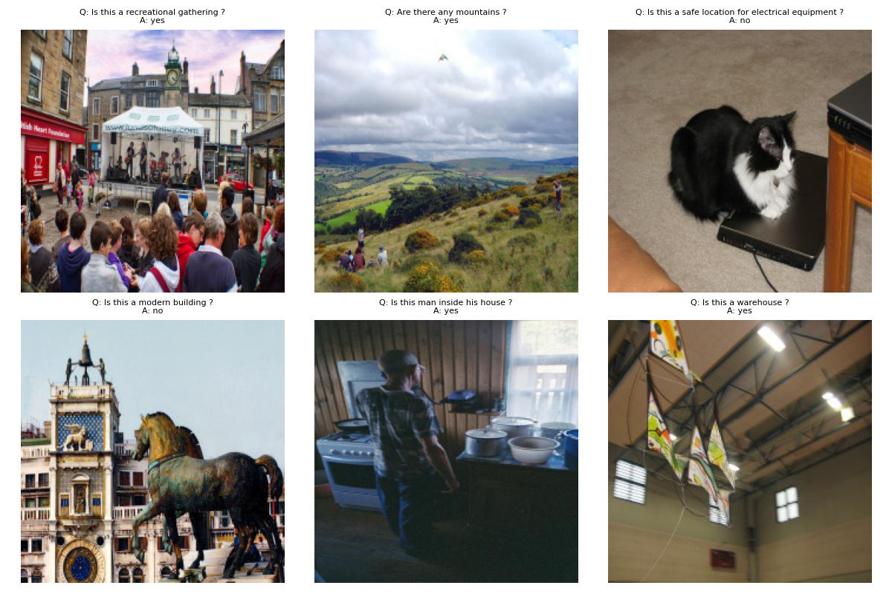
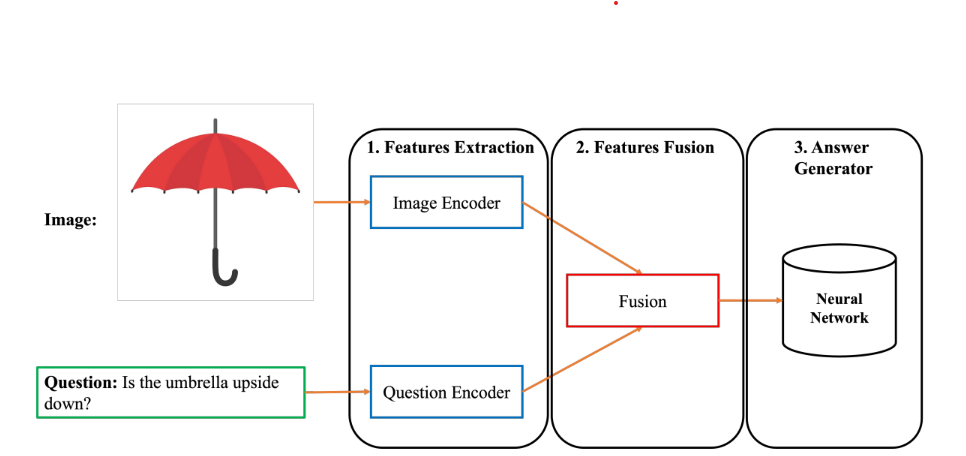

# Visual Question Answering

## Introduction

Visual Question Answering (VQA) is a widely studied problem in Machine Learning that lies at the intersection of Computer Vision and Natural Language Processing. The goal of VQA is to analyze an image and answer a question posed about that image. First, the system processes the inputs: extracting visual features from the image and parsing the natural-language question. Next, the VQA model combines these two sources of information to generate a coherent, context-aware answer. Building a highly accurate VQA system therefore requires strong performance in both visual understanding and language understanding, making the task particularly challenging.

## Data

You can download the dataset from [Google Drive](https://drive.google.com/drive/folders/1vXGWfqf4CSyOLRpq3IFM0rRIxNQTpRvE).

A small sample is shown below:

## Architecture

The overall VQA pipeline consists of three main modules:

1. **Feature Extraction** – extract modality-specific feature vectors that represent the visual content and the natural-language question.
2. **Feature Fusion** – merge the two modality features into a single joint representation capturing both image and text information.
3. **Answer Generator** – feed the fused representation into a neural network to predict the answer.

We implement two variants of this architecture:

- A baseline that uses CNNs for images and an LSTM for questions (**CNN + LSTM**).
- A transformer-based approach that combines a Vision Transformer (**ViT**) with **RoBERTa**.

Finally, we explore recent large-scale vision–language models and adapt them to the VQA task in this project.

## Results

### CNN + LSTM
- Val accuracy: 0.5138
- Test accuracy: 0.5104
